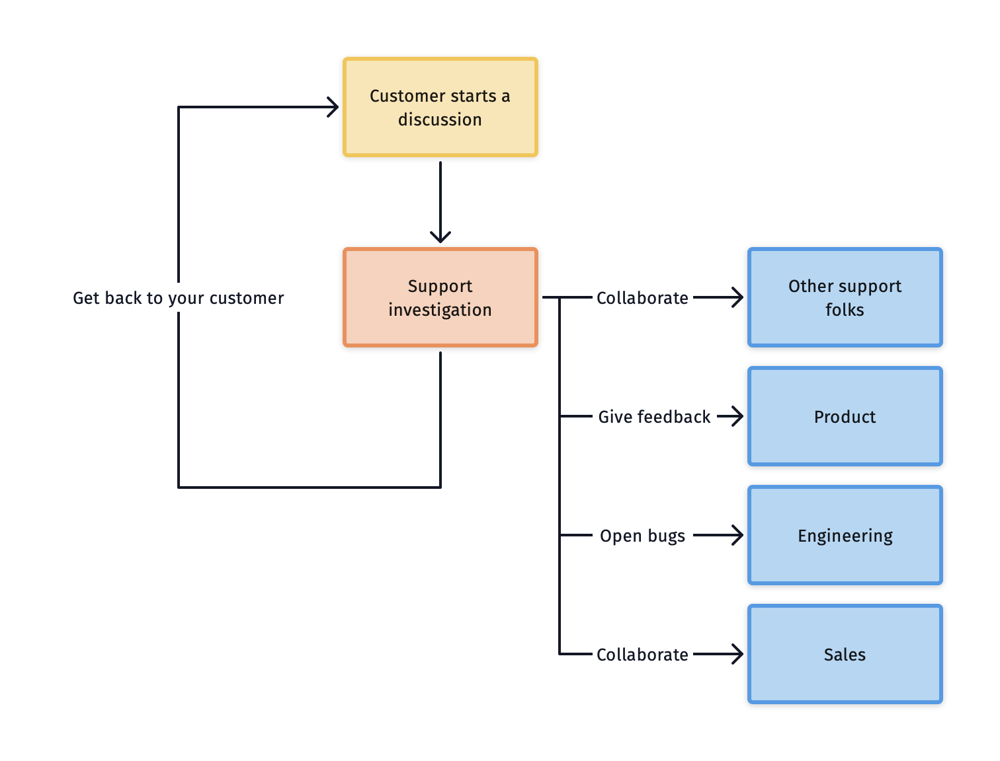

# What is Supportress?

Supportress is a simple and affordable helpdesk SaaS product. It allows you to offer customer support to your customers through email. You can hit the ground running with customer support in minutes.

### Who is it for?

It is built with other SaaS companies in mind, but we have plans for indie hackers and small teams that are just starting out.

It is opinionated and its goal is to allow you to support your customers without switching too much context.

### One tool, less context switching

Use one tool for the whole lifecycle:

* Your customer starts a new discussion
* You start checking facts and taking actions
* If there's customer feedback involved you can capture it and share it with other teams
* If there's an issue, you can capture a bug and share it with the programmers
* You can bring it to the attention of other customer facing teams, like your sales folks
* After checking, doing, capturing, and collaborating, you can respond and support you customer

### Product areas and features

Check out the main Product areas:

* [Organizations](organizations/organization.md)
* [Queues](queues/queue.md)
* [Discussions](discussions/discussion.md)

