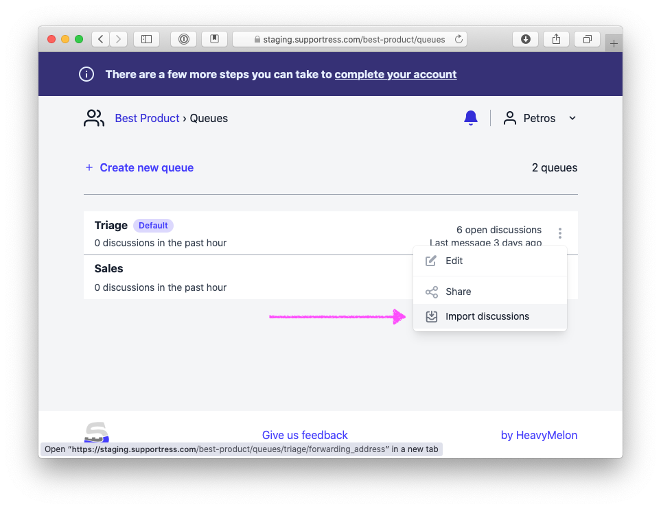

# Import discussions

Suppose one of your customers sent you an email outside of Supportress. Maybe they found your personal email address on the Internet, or they already had it and chose to start a discussion using that.

You want to move the discussion into Supportress in order to take advantage of its collaborative features and work with your team to craft the best response.

Each member in your Supportress organization has a unique personal forwarding address per queue. They can forward any email as an attachment to it. Supportress will start a discussion using the sender of the original email as the author of the discussion. It's as if your customer had started the discussion directly Supportress.

## Finding your personalized address for a queue

You can find your personalized address for a queue in `Queue > Import discussions`:

Generating a new email address

You can generate a new email address by clicking on the `Generate new` button. This will invalidate the old address and create a new one. This can be useful if the email address has leaked and is being used for spam.


Please note: Regular forwarding will not work. You have to forward the email as an attachment. See below for popular email client instructions.


## How to forward an email as an attachment

Forwarding an email as an attachment allows us to extract the necessary information in a robust and predictable way.

Here's how to do it with various popular email clients:



